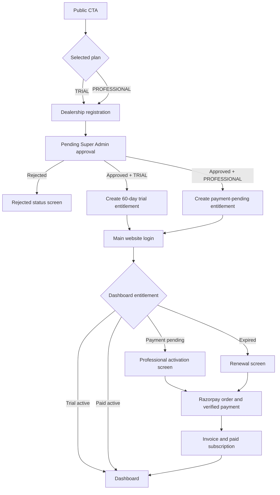

# Dealership Onboarding And Subscription Flow

## Implemented Paths

## Access Invariants

- `selectedPlan` is stored as `TRIAL` or `PROFESSIONAL` on new registration records.
- Existing records without `selectedPlan` remain backward-compatible and resolve to `TRIAL`.
- Professional approval never creates trial dates.
- Dashboard access requires an active trial or paid entitlement.
- Billing endpoints remain reachable while dashboard APIs remain blocked.
- Payment continues through the existing Razorpay order, verification, webhook, and invoice services.

## Screenshot Evidence

- `professional-payment-pending-desktop.png`
- `professional-payment-pending-mobile.png`
- `subscription-expired-desktop.png`
- `subscription-expired-mobile.png`

## Verification

- Backend JavaScript syntax checks passed.
- Subscription billing regression script passed.
- Frontend ESLint passed.
- Frontend production build passed.
